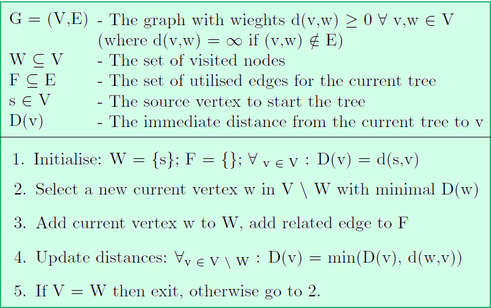
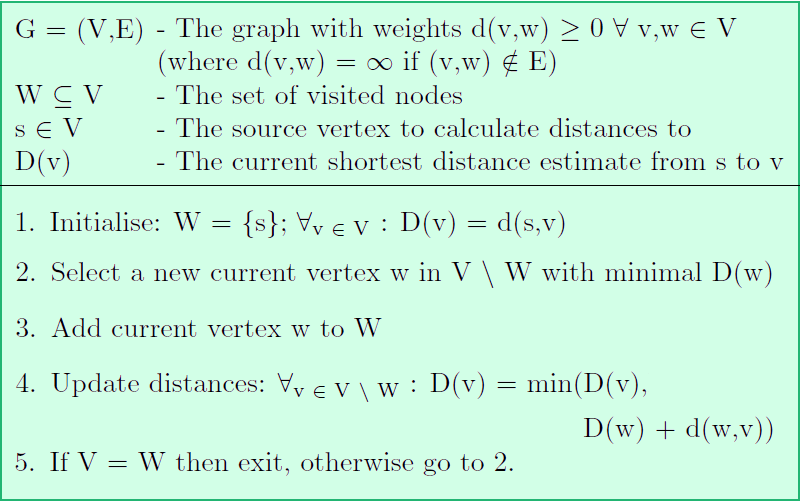

# Coursework 4, Prijkstras

For this coursework you will be implementing the some of the graph traversal algorithms that you have been learning about in the lectures namely Prim’s and Dijkstra’s.

You will need the following file:

* [cw4.zip](cw4.zip)

As a refresher, we have included the algorithms below:

## Prim's algorithm



## Dijkstra's algorithm




***

**TODO:** Create a repository with this code in it.

***

This repository contains a set of files that form a small graph library (in the folder src/graph). The graph files are well documented in the doc folder so refer to that when you are using them. This repository also contains a simple structure and some tests that you should make use of. We are leaving the way in which you implement the algorithms up to you but you should bear in mind the programming concepts and good practices that you have been taught. In particular, make sure that your implementations are efficient and easy to interact with. After all, they may come in handy in the future *wink* *wink*!

We have included a method stub and constructor in `src/Dijkstra.java`:

```java
public class Dijkstra {

    public Dijkstra(Graph<Integer, Integer> graph) {
        //TODO: Using the passed in graph, implement Dijkstras algorithm in this
        // class.
    }

    public List<Integer> shortestPath(Integer origin, Integer destination) {
        //TODO: You should return an ordered list of the node the indecies you
        // visit in your shortest path from origin to destination.
    }

}
```

and in `src/Prim.java` to get you started:

```java
public class Prim {

    public Prim(Graph<Integer, Integer> graph) {
        //TODO: Using the passed in graph, implement Prims algorithm in this
        // class.

    }

    public Graph<Integer, Integer> getMinimumSpanningTree() {
        //TODO: You should return a new graph that represents the minimum
        // spanning tree of the graph.
    }

}
```

***

**TODO:** Implement both of these algorithms.

***


##Optional
The `medium-graph.txt` in the resources folder is, in fact,  a representation of the roads around the university, where the edge weights are the length of that road. This is represented in the image below. Imagine that in addition to finding a path accross campus, we are running low on fuel and do not necessarily have enough to get to our destination.

[](Map.png)

Thankfully some of the nodes in our graph contain petrol stations (denoted by squares in the image) where we can refuel, but how do we plan our route now? Dijkstras algorithm can take into account the distance but is not able to weigh up the advantage of visiting a life-saving fuel stop.

In fact, Dijkstras can be thought of as a special case of another algorithm named A\*. As well as considering the weights in a graph, A* takes into account a heuristic estimate of the cost (or benefit) of visiting nodes. Look into how [A*](https://en.wikipedia.org/wiki/A*_search_algorithm) works in more detail and use the locations in the `petrol-stations.txt` file in resources to test an implementation of your own. How does varying the reward of visiting a petrol station change our route to the destination?

***

**TODO (optional):** Implement the A\* algorithm and use it with the provided `petrol-stations.txt` file.

***

